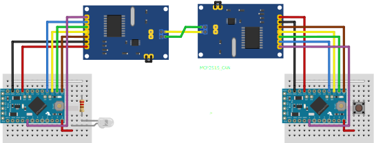

# CAN Controlled LED

This is a repository accompanying a blog entry [here](https://blog.wr4thon.de/posts/tech/homeautomation/setup/)

This is the code that lets you control a simple LED connected to an arduino via another arduino. The Arduinos are connected over a CAN bus with a MCP2515 module.

## Tools used

- [fritzing](https://fritzing.org/)
- [vsCode](https://code.visualstudio.com/)
- [platformIO](https://platformio.org/)

## Libraries

- [CAN_BUS_Shield](https://github.com/Seeed-Studio/Seeed_Arduino_CAN)